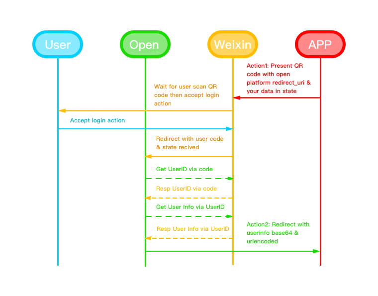

# open-platform

Auth microservice in Unique Studio

## 1. Auth Proccess



## 2. Action

### 2.1 Get Your Token

**Visit:** <https://open.hustunique.com/api>

#### Resp json:

``` json
{
    "Token":"SlmdgyzsMMAcj7GmmQoH_HkpQjWd6f1zRFaS5EcM6ZnmZEipLT_9RMdsN10gkUr7Q",
    "status":"OK"
}
```

### 2.2 Action1

> Via doc <https://work.weixin.qq.com/api/doc#10719>

#### Request URL :

`https://open.work.weixin.qq.com/wwopen/sso/qrConnect`

#### Urlencode Parameters:

Parameter|Required|Instruction
---|---|---
appid| yes| Work Weixin CorpID
agentid| yes| Agent ID: 1000011
redirect_uri| yes| Redirect URL: https://open.hustunique.com/auth (urlencoded)
state| no| urlsafe base64 encoded `json data string`

#### Json data string:

``` json
{
    "url":"your callback url",
    "token":"the token you got"
}
```

### 2.3 Action2

#### Redirect URL :`your callback url`

#### Redirect Urlencode Parameters:

Parameter|Instruction
---|---
state| urlsafe base64 encoded `user info`
timestamp| timestamp, example: `1423361979`

#### User info:

``` json
{
    "UserId":"TheUserUniqueID",
    "username":"username",
    "appid":"appid",
    "err":null,
    "phone":"17371266666",
    "state":"statedata"
}
```
